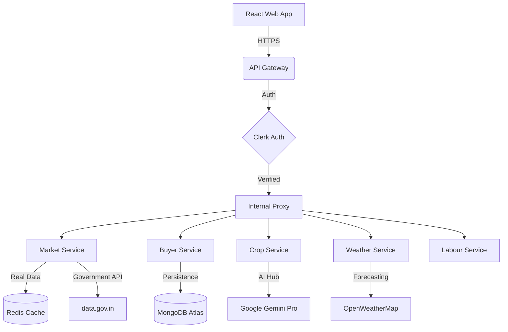

# 🌾 Smart Kisan (स्मार्ट किसान) — Agricultural Intelligence Platform

[](https://github.com/aku797473/bansalhackk/actions)
[](LICENSE)
[](#)

**Smart Kisan** is a cloud-native, microservices-based agricultural ecosystem designed to empower Indian farmers with real-time intelligence, marketplace connectivity, and AI-driven advisory.

---

## 🏗️ Technical Architecture

Smart Kisan follows a **Cloud-Native Microservices Architecture** designed for high availability and geospatial scalability.



---

## 🧩 Microservice Catalog

| Service | Port | Responsibility |
| :--- | :--- | :--- |
| **API Gateway** | 5000 | Central routing, security hardening, rate limiting, and auth validation. |
| **Market Service** | 5006 | Real-time Mandi price tracking (Agmarknet) with AI-driven trend analysis. |
| **Buyer Service** | 5012 | Unified marketplace for shop registration, inventory management, and orders. |
| **Crop Service** | 5004 | AI soil analysis and personalized crop recommendations using Gemini Pro. |
| **Weather Service**| 5003 | Hyper-local weather forecasting with agricultural alerts and Redis caching. |
| **Labour Service** | 5007 | Geospatial matching for agricultural workers and farmers using MongoDB GeoJSON. |
| **Chatbot Service**| 5008 | Multilingual (Hindi/English) AI assistant for instant agricultural support. |

---

## 🚀 Startup Roadmap (Phased Development)

### ✅ Phase 1: Infrastructure & Reliability (Current)
- Unified microservices architecture.
- Real-time Government data integration for Mandis.
- Hardened security with strict CORS and rate limiting.
- Automated CI/CD pipelines via GitHub Actions.

### ⏳ Phase 2: User Growth & Offline Experience
- **PWA Integration:** Full offline support for remote farm locations.
- **Advanced Search:** Integration with Meilisearch for high-speed commodity discovery.
- **Farmer Profiles:** Personalized dashboards with NPK soil history.

### 🔮 Phase 3: Financial & Supply Chain Scale
- **Direct-to-Buyer:** Peer-to-peer logistics tracking for bulk orders.
- **Micro-Insurance:** Weather-linked crop insurance advisory.
- **B2B Analytics:** Dashboards for Mandi traders and bulk buyers.

---

## 🛠️ Getting Started (Developer Guide)

### Prerequisites
- Node.js 18+
- Docker & Docker Compose
- MongoDB Atlas & Redis (Upstash recommended)

### Local Development
1. Clone the repository.
2. Create a root `.env` based on `.env.example`.
3. Spin up the entire ecosystem:
   ```bash
   docker-compose up --build
   ```
4. Access the frontend at `http://localhost:5173` and Gateway at `http://localhost:5000`.

---

## 📜 License
Distributed under the MIT License. See `LICENSE` for more information.

---
*Developed with ❤️ for the Indian Farming Community — Smart Kisan v1.5*
