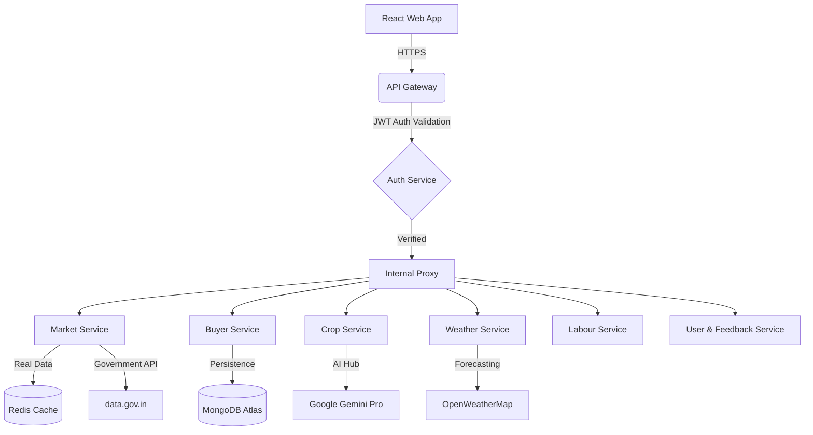

# 🌾 Smart Kisan (स्मार्ट किसान) — Intelligent Agri-Tech Platform

[](https://github.com/aku797473/bansalhackk/actions)
[](LICENSE)
[](#)

**Smart Kisan** is a next-generation, cloud-native agricultural ecosystem designed to empower Indian farmers, buyers, and agricultural laborers. By combining modern UI/UX principles with cutting-edge Microservices and AI, Smart Kisan provides real-time market intelligence, localized weather forecasting, AI-driven crop advisory, and a unified marketplace.

---

## ✨ Key Features & Innovations

1. **State-of-the-art Authentication & Security**
   - Implements robust **JWT-based Authentication** with long-lived Refresh Tokens.
   - Enforces **SaaS-Standard Password Policies** (Min 8 chars, Uppercase, Lowercase, Number, Special Character).
   - Seamless **Google OAuth Integration** using Firebase Auth.
   - Free **Simulated OTP Flow** for Account Recovery & Password Resets.

2. **Premium Floating UI & UX Design**
   - Features a clean, **Glassmorphism-inspired Dashboard** with a floating right-aligned header.
   - Intelligent **Throttled Feedback System**: A beautiful `Rate Your Experience` modal pops up upon logout, smartly throttled to once every 7 days to maintain a frictionless user experience.
   - Dynamic Dark/Light mode support with smooth tailwind transitions.

3. **Microservices-Driven Architecture**
   - **Market Service:** Fetches real-time Mandi prices using Government APIs (data.gov.in) with Upstash Redis caching.
   - **AI Chatbot Service:** A multilingual smart assistant built on Gemini Pro to answer farming queries instantly.
   - **Crop & Fertilizer Service:** Soil analysis and data-driven recommendations.
   - **Labour Service:** Geospatial job matching for farm laborers.

---

## 🏗️ Technical Architecture

Smart Kisan follows a **Cloud-Native Microservices Architecture** designed for high availability and geospatial scalability.



---

## 🛠️ Getting Started (Developer Guide)

### Prerequisites
- Node.js 18+
- Docker & Docker Compose
- MongoDB Atlas & Redis (Upstash recommended)

### Local Development
1. Clone the repository:
   ```bash
   git clone https://github.com/aku797473/bansalhackk.git
   cd smart-kisan
   ```
2. Create a root `.env` based on `.env.example`.
3. Spin up the entire ecosystem via Docker:
   ```bash
   docker-compose up --build
   ```
   *Alternatively, run `npm run dev` in the root directory to spin up all microservices and the frontend concurrently.*
4. Access the frontend at `http://localhost:5173` and the Unified Gateway at `http://localhost:5000`.

---

## 📜 License
Distributed under the MIT License. See `LICENSE` for more information.

---
*Developed with ❤️ for the Indian Farming Community — Smart Kisan v2.0*
