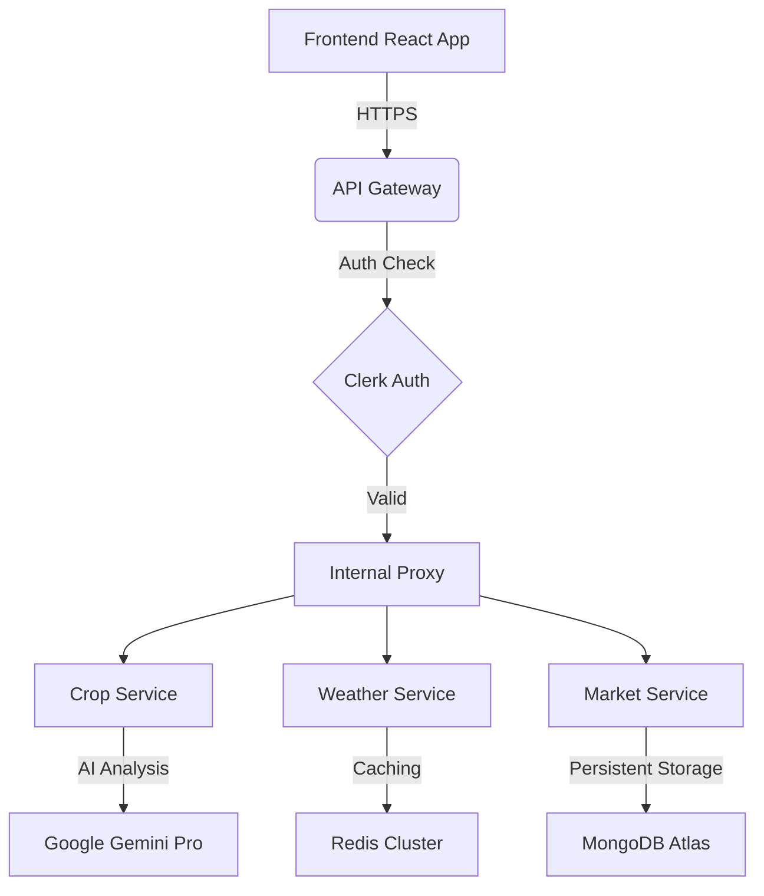

# 🏗️ Smart Kisan — Backend Architecture

This document provides a technical deep-dive into the Smart Kisan backend ecosystem, a high-performance microservices architecture designed for scalability, reliability, and real-time agricultural intelligence.

---

## 🛰️ 1. Architecture Overview
Smart Kisan follows a **Cloud-Native Microservices Architecture**. Instead of a monolithic backend, the system is decoupled into specialized services that communicate over a virtualized Docker network.

### Key Components:
- **API Gateway**: The central "Brain" that handles routing, load balancing, and security.
- **Service Mesh**: Independent Node.js/Express services for each core feature.
- **Hybrid Data Layer**: MongoDB for persistent state + Redis for ultra-fast caching.
- **AI Hub**: Direct integration with Google Gemini Pro for intelligent advisory.

---

## 🧩 2. Microservice Breakdown

### 🛂 API Gateway (Port 5000)
- **Role**: Entry point for all frontend requests.
- **Responsibilities**: 
  - Route forwarding to internal services.
  - Auth validation via Clerk.
  - Global CORS management.
  - Service health monitoring.

### 🌾 Crop Advisory Service (Port 5001)
- **Engine**: Google Gemini AI (Generative AI SDK).
- **Function**: Processes soil parameters (N, P, K, pH) and environmental data to recommend optimal crops.
- **Optimization**: Uses custom prompt engineering to enforce 100% JSON compliance for zero-latency parsing.

### 🌦️ Weather Service (Port 5002)
- **Source**: OpenWeatherMap API + IMD (Indian Meteorological Dept) fallbacks.
- **Function**: Real-time hyper-local weather tracking and multi-day forecasting.
- **Caching**: 10-minute TTL (Time-To-Live) on Redis to minimize external API costs.

### 📊 Market Intelligence Service (Port 5003)
- **Source**: Agmarknet (Government Data) + Real-time scrapers.
- **Function**: National commodity price tracking, historical trends, and price forecasting.
- **Coverage**: All 28 Indian states and 750+ Mandis.

### 👥 Labour Marketplace Service (Port 5004)
- **Function**: Geo-spatial matching of farmers with skilled agricultural labor.
- **Tech**: MongoDB GeoJSON indexing for proximity-based search.

---

## ⚡ 3. High-Performance Caching (Redis)
To ensure the app feels "instant," we implemented a **Multi-Layer Caching Strategy**:

1.  **Cold Start Prevention**: Local Redis nodes within the Docker network prioritize low-latency local traffic over remote nodes.
2.  **Request Deduplication**: Identical weather/market requests within a 5-minute window are served directly from RAM.
3.  **Resilience**: The backend implements an **Automatic Memory Fallback**—if Redis goes down, services automatically switch to in-memory `Map` caching to prevent crashes.

---

## 🔐 4. Security & Authentication
- **Provider**: Clerk (Identity-as-a-Service).
- **Flow**:
  1. Frontend acquires a JWT from Clerk.
  2. JWT is passed in the `Authorization` header.
  3. API Gateway validates the token using the Clerk Secret Key.
  4. Once validated, the request is proxied to the target microservice.

---

## 🚀 5. Deployment & Infrastructure
- **Containerization**: Docker & Docker Compose for consistent dev/prod parity.
- **Orchestration**: Render / AWS (EC2) with auto-restart policies.
- **Environment Management**: Strict `.env` separation for API Keys (Gemini, OpenWeather, Clerk).

---

## 🔄 6. Data Flow Diagram

---
*Generated for Smart Kisan Hackathon Presentation — May 2026*
